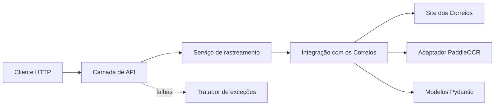
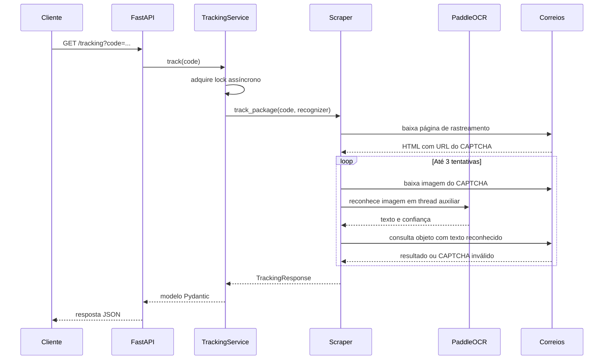

# Tracking Automatic API

API HTTP para consulta e normalização do histórico de rastreamento de objetos dos Correios.

O sistema acessa a página pública de rastreamento, identifica o desafio CAPTCHA, utiliza reconhecimento óptico de caracteres (OCR) para resolvê-lo e converte a resposta obtida em um contrato JSON estável para aplicações clientes.

## Resumo

O Tracking Automatic foi desenvolvido como um monólito modular assíncrono. A solução separa transporte HTTP, orquestração, integração externa, regras de transformação e reconhecimento de imagem em módulos com responsabilidades distintas.

O projeto busca demonstrar a aplicação dos seguintes conceitos:

- construção de APIs REST com contratos tipados;
- integração resiliente com uma fonte externa não controlada;
- extração e normalização de dados semiestruturados;
- inferência de OCR integrada ao ciclo de vida de uma aplicação web;
- tratamento uniforme de erros de domínio;
- controle explícito de concorrência sobre um recurso computacional compartilhado;
- empacotamento e execução reprodutível com containers.

## Objetivo

O objetivo principal é oferecer ao cliente uma representação previsível dos eventos de rastreamento, ocultando os detalhes necessários para consultar a origem dos dados.

A API é responsável por:

1. receber, separar e normalizar até 20 códigos informados;
2. estabelecer uma sessão HTTP com o site dos Correios;
3. localizar e baixar a imagem do CAPTCHA;
4. reconhecer o texto da imagem com PaddleOCR;
5. repetir a tentativa em caso de CAPTCHA inválido, até o limite configurado;
6. escolher o fluxo individual ou múltiplo e interpretar a resposta dos Correios;
7. converter eventos, endereços e datas em modelos tipados;
8. traduzir falhas de domínio em respostas HTTP consistentes.

## Arquitetura

A aplicação segue uma arquitetura em camadas dentro de uma única unidade de implantação.



### Camadas e responsabilidades

| Camada | Localização | Responsabilidade |
| --- | --- | --- |
| Entrada ASGI | `main.py` | Cria e expõe a aplicação para o servidor ASGI. |
| Apresentação | `api/routes/` | Define endpoints, parâmetros, modelos de resposta e documentação OpenAPI. |
| Aplicação | `api/services/` | Orquestra o caso de uso e controla o acesso concorrente ao OCR. |
| Integração | `bot/scrapper.py` | Mantém a sessão HTTP, resolve o desafio e transforma a resposta externa. |
| Domínio | `bot/models.py` e `bot/exceptions.py` | Define contratos imutáveis e falhas conhecidas do rastreamento. |
| Infraestrutura | `solver/paddle_ocr.py` | Encapsula a inicialização e a inferência do PaddleOCR. |
| Transporte de erros | `api/exception_handlers.py` | Converte exceções do domínio em respostas HTTP. |

### Estrutura de diretórios

```text
tracking_automatic/
|-- api/
|   |-- routes/
|   |   `-- tracking.py
|   |-- services/
|   |   `-- tracking.py
|   |-- app.py
|   `-- exception_handlers.py
|-- bot/
|   |-- exceptions.py
|   |-- models.py
|   `-- scrapper.py
|-- solver/
|   |-- paddle_ocr.py
|   `-- requirements_ocr.txt
|-- tests/
|   `-- test_scrapper.py
|-- compose.yaml
|-- Dockerfile
|-- main.py
`-- requirements.txt
```

## Fluxo de uma consulta



### Ciclo de vida e concorrência

O modelo do PaddleOCR é inicializado durante o `lifespan` do FastAPI e reutilizado entre as consultas. Essa estratégia evita o custo de carregar o modelo a cada requisição.

Como a instância do OCR é compartilhada e a inferência consome quantidade relevante de CPU e memória, o `TrackingService` utiliza um `asyncio.Lock`. Assim, cada processo atende uma consulta de rastreamento por vez. Operações bloqueantes de inicialização e inferência são encaminhadas para uma thread auxiliar com `asyncio.to_thread`, preservando o event loop da aplicação.

Essa decisão privilegia previsibilidade de recursos em uma implantação pequena. Para maior vazão, seria necessário distribuir o processamento entre processos ou workers especializados.

### Tratamento dos dados

O scraper realiza as seguintes transformações antes de construir a resposta:

- separa os códigos por vírgula, remove espaços e padroniza letras maiúsculas;
- converte o código para letras maiúsculas;
- combina tipo, logradouro, número, bairro, cidade e UF das unidades postais;
- diferencia unidade de origem e destino;
- converte data e fuso horário para `datetime`;
- usa o evento mais recente como status atual;
- valida o resultado por meio de modelos Pydantic imutáveis.

As imagens de CAPTCHA são gravadas em diretórios temporários e removidas ao término de cada tentativa.

## Tecnologias

- Python 3.12+
- FastAPI e Uvicorn
- Pydantic
- HTTPX
- Beautiful Soup
- PaddleOCR e PaddlePaddle
- Docker e Docker Compose

## Contrato HTTP

### Consultar rastreamento

```http
GET /tracking?code=TJ481246775BR%2CAP073539958BR
```

O parâmetro `code` aceita de um a vinte códigos, separados por vírgula. Espaços dentro ou entre os códigos são opcionais.

Exemplo de resposta bem-sucedida:

```json
{
  "results": [
    {
      "tracking_code": "TJ481246775BR",
      "service": "SEDEX",
      "current_status": "Objeto entregue ao destinatário",
      "events": [
        {
          "description": "Objeto entregue ao destinatário",
          "details": ["Agência dos Correios, Monte Sião - MG"],
          "occurred_at": "2026-05-22T12:44:04-03:00"
        }
      ]
    },
    {
      "tracking_code": "AP073539958BR",
      "service": "ENCOMENDA PAC",
      "current_status": "Objeto em transferência - por favor aguarde",
      "events": []
    }
  ]
}
```

O contrato é o mesmo para consultas individuais e múltiplas. Uma consulta individual retorna `results` com um elemento.

### Respostas de erro

As falhas conhecidas seguem o contrato:

```json
{
  "code": "INVALID_TRACKING_CODE",
  "message": "Código de objeto informado não está válido"
}
```

| Status | Código | Situação |
| --- | --- | --- |
| `404` | `TRACKING_NOT_FOUND` | O objeto não foi localizado. |
| `422` | `INVALID_TRACKING_CODE` | O código informado foi rejeitado. |
| `422` | `DOCUMENT_NOT_SUPPORTED` | A entrada possui formato de CPF ou CNPJ; somente códigos de rastreamento são aceitos. |
| `422` | `TRACKING_LIMIT_EXCEEDED` | Foram enviados mais de 20 códigos na mesma consulta. |
| `502` | `CAPTCHA_RETRIES_EXHAUSTED` | As tentativas de reconhecimento foram esgotadas. |
| `502` | `CORREIOS_UNAVAILABLE` | Houve falha na comunicação ou na interpretação da resposta externa. |

A especificação OpenAPI e a interface Swagger ficam disponíveis em `/docs`. A rota `/` redireciona para essa documentação.

## Testes automatizados

Os testes unitários cobrem validação de entradas, limite de objetos, CPF/CNPJ, duplicidades e transformação ordenada da resposta múltipla.

```powershell
python -m unittest discover -v
```

## Execução local

### Requisitos

- Python 3.12 ou superior;
- `pip`;
- conexão com a internet para acessar os Correios e obter os modelos do PaddleOCR na primeira execução.

Crie e ative um ambiente virtual:

```powershell
python -m venv .venv
.\.venv\Scripts\Activate.ps1
```

Instale as dependências:

```powershell
pip install -r requirements.txt
```

Inicie a API:

```powershell
uvicorn main:app --reload
```

Endereços locais:

- API: `http://127.0.0.1:8000`;
- Swagger UI: `http://127.0.0.1:8000/docs`;
- esquema OpenAPI: `http://127.0.0.1:8000/openapi.json`.

## Configuração

| Variável | Obrigatória | Valor padrão | Descrição |
| --- | --- | --- | --- |
| `CORS_ORIGINS` | Não | origens locais e frontend publicado | Lista de origens permitidas, separadas por vírgula e sem caminhos. |
| `LOG_LEVEL` | Não | `INFO` | Nível dos logs da aplicação (`DEBUG`, `INFO`, `WARNING`, `ERROR` ou `CRITICAL`). |

Exemplo para desenvolvimento:

```powershell
$env:CORS_ORIGINS="http://localhost:5173,http://127.0.0.1:5173"
$env:LOG_LEVEL="INFO"
uvicorn main:app --reload
```

## Logs operacionais

A aplicação emite logs somente nos pontos essenciais do processamento:

- inicialização e encerramento do serviço;
- início e conclusão de cada consulta;
- CAPTCHA vazio ou rejeitado;
- falhas de domínio, comunicação, OCR e erros inesperados.

Cada consulta recebe um `request_id` curto para correlacionar seus eventos. Códigos de rastreamento, texto do CAPTCHA, imagens e payloads externos não são registrados.

## Execução com Docker

Construa e inicie o serviço:

```powershell
docker compose up --build -d
```

Consulte o estado e os logs:

```powershell
docker compose ps
docker compose logs -f
```

Encerre os containers:

```powershell
docker compose down
```

O Compose inclui:

- limite de 1 CPU e 512 MB de memória;
- apenas um worker Uvicorn;
- reinicialização automática;
- processo `init` para tratamento adequado de sinais;
- healthcheck baseado no esquema OpenAPI;
- volume persistente para o cache de modelos do PaddleOCR.

O limite de 512 MB atende ao perfil local definido pelo projeto, mas a memória necessária deve ser validada no ambiente de produção de acordo com o modelo, a plataforma e a carga.

## Características de implantação

O `Dockerfile` utiliza uma imagem Python reduzida, instala somente as bibliotecas nativas necessárias e executa a aplicação com um usuário sem privilégios administrativos.

O container expõe a porta `8000` e inicia um único worker. Em plataformas que exigem outra porta, o mapeamento ou o comando de inicialização deve ser ajustado na configuração do serviço.

## Limitações e trabalhos futuros

- a solução depende da estrutura HTML e do contrato de resposta dos Correios;
- a precisão da consulta depende do reconhecimento correto do CAPTCHA;
- cada instância processa uma consulta por vez devido ao lock do OCR;
- não há cache de resultados nem limitação de requisições por cliente;
- ainda não existem métricas, tracing ou logs estruturados;
- a validação local bloqueia CPF, CNPJ, duplicidades, formatos inválidos e consultas acima de 20 objetos.

Evoluções previstas incluem testes unitários e de integração, observabilidade, cache com expiração, rate limiting e processamento do OCR em workers dedicados.

## Frontend

A interface web está no diretório `tracking_automatic_web` deste workspace e pode ser acessada em [tracking-automatic-web.vercel.app](https://tracking-automatic-web.vercel.app).

## Aviso

Este é um projeto independente, sem vínculo oficial com os Correios. Mudanças no serviço externo podem exigir adaptações na integração.
