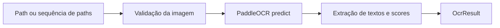

# CAPTCHA OCR Solver

Componente de reconhecimento óptico de caracteres utilizado pelo Tracking Automatic para extrair texto de imagens de CAPTCHA.

O solver encapsula o PaddleOCR atrás de uma interface Python pequena e também oferece uma interface de linha de comando para avaliação manual de imagens isoladas ou diretórios.

## Objetivo

O módulo tem como responsabilidades:

- inicializar e manter uma instância do PaddleOCR;
- validar a existência e o formato das imagens recebidas;
- executar a inferência de reconhecimento textual;
- normalizar a saída produzida pelo PaddleOCR 3.x;
- calcular a confiança média dos fragmentos reconhecidos;
- medir o tempo de inferência;
- processar uma coleção de imagens sequencialmente;
- apresentar resultados em formato legível pela linha de comando.

O solver não acessa os Correios, não baixa imagens e não valida se o texto reconhecido é um CAPTCHA válido. Essas responsabilidades pertencem à camada de integração da aplicação.

## Arquitetura do componente



O arquivo principal é [`paddle_ocr.py`](paddle_ocr.py), composto pelos seguintes elementos:

| Elemento | Responsabilidade |
| --- | --- |
| `PaddleCaptchaOcr` | Mantém o mecanismo carregado e expõe as operações de reconhecimento. |
| `OcrResult` | Representa o resultado imutável de uma inferência. |
| `find_images` | Descobre imagens em um arquivo ou diretório. |
| `build_parser` | Define os argumentos aceitos pela CLI. |
| `print_results` | Formata os resultados para saída no terminal. |
| `main` | Coordena descoberta, inicialização, inferência e código de saída. |

## Pipeline de reconhecimento

Para cada imagem, o componente executa as seguintes etapas:

1. expande o caminho informado e o converte em caminho absoluto;
2. verifica se o arquivo existe;
3. valida a extensão da imagem;
4. registra o início da medição;
5. chama `PaddleOCR.predict`;
6. extrai `rec_texts` e `rec_scores` de cada página retornada;
7. concatena os fragmentos textuais sem separador;
8. calcula a média aritmética das confianças disponíveis;
9. devolve um objeto `OcrResult`.

O tempo registrado corresponde à chamada de inferência. A inicialização do modelo não faz parte de `elapsed_seconds`.

## Configuração do PaddleOCR

Por padrão, o modelo é inicializado para português:

```python
PaddleOCR(
    lang="pt",
    use_doc_orientation_classify=False,
    use_doc_unwarping=False,
    use_textline_orientation=False,
    enable_mkldnn=False,
)
```

Recursos voltados a documentos, como correção de orientação e desentortamento, são desativados porque as entradas esperadas são imagens pequenas de CAPTCHA. O MKL-DNN também permanece desativado na configuração atual.

## Modelo de resultado

Cada reconhecimento produz uma instância imutável de `OcrResult`:

| Campo | Tipo | Descrição |
| --- | --- | --- |
| `image_path` | `Path` | Caminho absoluto da imagem processada. |
| `text` | `str` | Fragmentos reconhecidos, concatenados e sem espaços nas extremidades. |
| `confidence` | `float` | Média dos scores retornados, entre `0.0` e `1.0`. |
| `elapsed_seconds` | `float` | Duração da inferência em segundos. |

Quando não existem scores, a confiança é definida como `0.0`. A ausência de texto não gera exceção; nesse caso, `text` contém uma string vazia.

## Formatos aceitos

- BMP (`.bmp`)
- JPEG (`.jpeg` e `.jpg`)
- PNG (`.png`)
- TIFF (`.tif` e `.tiff`)
- WebP (`.webp`)

A extensão é comparada sem diferenciação entre letras maiúsculas e minúsculas.

## Requisitos

- Python 3.12 ou superior;
- PaddleOCR 3.x;
- PaddlePaddle 3.x;
- conexão com a internet na primeira inicialização, caso os modelos ainda não estejam no cache local.

As versões suportadas estão declaradas em [`requirements_ocr.txt`](requirements_ocr.txt).

## Instalação

A partir da raiz da API, crie e ative um ambiente virtual:

```powershell
python -m venv .venv
.\.venv\Scripts\Activate.ps1
```

Instale apenas as dependências do solver:

```powershell
pip install -r solver\requirements_ocr.txt
```

Para instalar o solver junto com a aplicação completa:

```powershell
pip install -r requirements.txt
```

Na primeira execução, o PaddleOCR pode baixar os modelos necessários. As execuções seguintes reutilizam o cache do ambiente.

## Uso pela linha de comando

Execute o módulo a partir da raiz da API:

```powershell
python -m solver.paddle_ocr caminho\para\captcha.png
```

Também é possível processar todas as imagens suportadas de um diretório:

```powershell
python -m solver.paddle_ocr caminho\para\imagens
```

Para selecionar outro idioma suportado pelo PaddleOCR:

```powershell
python -m solver.paddle_ocr caminho\para\captcha.png --language en
```

Sem o argumento `source`, a CLI procura imagens em:

```text
artefatos/img_captcha
```

Exemplo de saída:

```text
captcha.png: A7B9C (confianca: 96.42%, tempo: 0.31s)
```

A CLI retorna código `0` quando conclui o processamento e código `1` quando não encontra imagens ou ocorre alguma falha.

## Uso como biblioteca

### Imagem individual

```python
from pathlib import Path

from solver.paddle_ocr import PaddleCaptchaOcr


recognizer = PaddleCaptchaOcr(language="pt")
result = recognizer.recognize(Path("captcha.png"))

print(result.text)
print(result.confidence)
print(result.elapsed_seconds)
```

### Múltiplas imagens

```python
from pathlib import Path

from solver.paddle_ocr import PaddleCaptchaOcr, find_images


recognizer = PaddleCaptchaOcr()
images = find_images(Path("artefatos/img_captcha"))
results = recognizer.recognize_many(images)
```

`recognize_many` processa as imagens sequencialmente e reutiliza a mesma instância do modelo. Isso reduz o custo de inicialização, mas não introduz paralelismo.

## Integração com a API

Na aplicação principal, o solver é inicializado uma única vez durante o ciclo de vida do FastAPI:

```python
recognizer = await asyncio.to_thread(PaddleCaptchaOcr)
```

Durante uma consulta, a imagem temporária é enviada ao método `recognize` em uma thread auxiliar:

```python
ocr_result = await asyncio.to_thread(recognizer.recognize, captcha_path)
```

O solver possui uma API síncrona e não implementa controle próprio de concorrência. No Tracking Automatic, o `TrackingService` serializa o acesso à instância compartilhada com `asyncio.Lock`.

Após o reconhecimento, a camada de integração remove caracteres não alfanuméricos do texto antes de enviá-lo aos Correios. Essa limpeza não ocorre dentro do solver para que o componente continue reutilizável em outros contextos de OCR.

## Tratamento de erros

| Exceção | Condição |
| --- | --- |
| `FileNotFoundError` | O arquivo ou diretório informado não existe. |
| `ValueError` | A extensão do arquivo não é suportada. |
| `TypeError` | O PaddleOCR devolve uma estrutura incompatível com a versão esperada. |

Na interface Python, essas exceções são propagadas ao chamador. Na CLI, elas são capturadas, exibidas no terminal e convertidas no código de saída `1`.

## Considerações de desempenho

- a inicialização do PaddleOCR é mais custosa que uma inferência isolada;
- a mesma instância deve ser reutilizada sempre que possível;
- o consumo de CPU e memória depende dos modelos e do ambiente;
- o processamento em lote atual é sequencial;
- a confiança média é informativa e não representa garantia de acerto;
- a medição atual não inclui leitura do arquivo nem inicialização do modelo.

## Limitações e evoluções futuras

- ainda não existem testes automatizados do componente;
- não há limiar mínimo de confiança para rejeitar resultados;
- não existe pré-processamento específico de contraste, ruído ou segmentação;
- os fragmentos reconhecidos são concatenados na ordem fornecida pelo PaddleOCR;
- resultados de benchmark não são persistidos;
- o comportamento depende do contrato de saída do PaddleOCR 3.x.

Possíveis evoluções incluem testes com imagens controladas, métricas de acurácia, limiar configurável de confiança, pré-processamento opcional e benchmark reproduzível por conjunto de dados.
